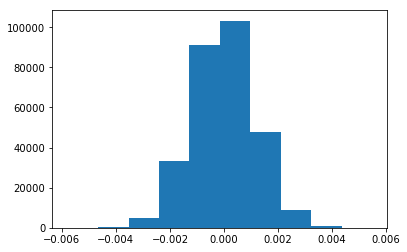

## Analyze A/B Test Results

This project will assure you have mastered the subjects covered in the statistics lessons.  The hope is to have this project be as comprehensive of these topics as possible.  Good luck!

## Table of Contents
- [Introduction](#intro)
- [Part I - Probability](#probability)
- [Part II - A/B Test](#ab_test)
- [Part III - Regression](#regression)


<a id='intro'></a>
### Introduction

A/B tests are very commonly performed by data analysts and data scientists.  It is important that you get some practice working with the difficulties of these 

For this project, you will be working to understand the results of an A/B test run by an e-commerce website.  Your goal is to work through this notebook to help the company understand if they should implement the new page, keep the old page, or perhaps run the experiment longer to make their decision.

**As you work through this notebook, follow along in the classroom and answer the corresponding quiz questions associated with each question.** The labels for each classroom concept are provided for each question.  This will assure you are on the right track as you work through the project, and you can feel more confident in your final submission meeting the criteria.  As a final check, assure you meet all the criteria on the [RUBRIC](https://review.udacity.com/#!/projects/37e27304-ad47-4eb0-a1ab-8c12f60e43d0/rubric).

<a id='probability'></a>
#### Part I - Probability

To get started, let's import our libraries.


```python
import pandas as pd
import numpy as np
import random
import matplotlib.pyplot as plt
%matplotlib inline
#We are setting the seed to assure you get the same answers on quizzes as we set up
random.seed(42)
```

`1.` Now, read in the `ab_data.csv` data. Store it in `df`.  **Use your dataframe to answer the questions in Quiz 1 of the classroom.**

a. Read in the dataset and take a look at the top few rows here:


```python
# Load the CSV file first and take a look at the top few rows
df = pd.read_csv('ab_data.csv');
df.head()
```


<div>
<table border="1" class="dataframe">
  <thead>
    <tr style="text-align: right;">
      <th></th>
      <th>user_id</th>
      <th>timestamp</th>
      <th>group</th>
      <th>landing_page</th>
      <th>converted</th>
    </tr>
  </thead>
  <tbody>
    <tr>
      <th>0</th>
      <td>851104</td>
      <td>2017-01-21 22:11:48.556739</td>
      <td>control</td>
      <td>old_page</td>
      <td>0</td>
    </tr>
    <tr>
      <th>1</th>
      <td>804228</td>
      <td>2017-01-12 08:01:45.159739</td>
      <td>control</td>
      <td>old_page</td>
      <td>0</td>
    </tr>
    <tr>
      <th>2</th>
      <td>661590</td>
      <td>2017-01-11 16:55:06.154213</td>
      <td>treatment</td>
      <td>new_page</td>
      <td>0</td>
    </tr>
    <tr>
      <th>3</th>
      <td>853541</td>
      <td>2017-01-08 18:28:03.143765</td>
      <td>treatment</td>
      <td>new_page</td>
      <td>0</td>
    </tr>
    <tr>
      <th>4</th>
      <td>864975</td>
      <td>2017-01-21 01:52:26.210827</td>
      <td>control</td>
      <td>old_page</td>
      <td>1</td>
    </tr>
  </tbody>
</table>
</div>


b. Use the below cell to find the number of rows in the dataset.


```python
# Check its dimension
df.shape[0]
```


    294478


c. The number of unique users in the dataset.


```python
# Function nunique can tell us the number of unique values in the series
df['user_id'].nunique()
```


    290584


d. The proportion of users converted.


```python
# The proportion can be computed by mean method if the content values is 1 or 0.
np.mean(df['converted'])
```


    0.11965919355605512


e. The number of times the `new_page` and `treatment` don't line up.


```python
# There are four possible pairs from the group and land_page columns
# 1. <control + old_page>
# 2. <control + new_page>
# 3. <treatment + old_page>
# 4. <treatment + new_page>

# First, check the number of new landing page in the control group, which is the second pair in the above
ctr_group = df[df['group'] == 'control'];
number_new_page_in_ctr_group = ctr_group[ctr_group['landing_page'] == 'new_page'].shape[0];

# Second, check the number of old landing page in the treatment group, which is the third pair in the above
treatment_group = df[df['group'] == 'treatment'];
number_old_page_in_treatment_group = treatment_group[treatment_group['landing_page'] == 'old_page'].shape[0];

# Finally, add these two values
print (number_new_page_in_ctr_group + number_old_page_in_treatment_group)
```

    3893


f. Do any of the rows have missing values?


```python
# Check if there are some missing data by using info()
df.info()
```

    <class 'pandas.core.frame.DataFrame'>
    RangeIndex: 294478 entries, 0 to 294477
    Data columns (total 5 columns):
    user_id         294478 non-null int64
    timestamp       294478 non-null object
    group           294478 non-null object
    landing_page    294478 non-null object
    converted       294478 non-null int64
    dtypes: int64(2), object(3)
    memory usage: 11.2+ MB


We don't have any missing rows because the number of valid contents in each column are equal to 294478 which is the number of rows in this dataset.

`2.` For the rows where **treatment** is not aligned with **new_page** or **control** is not aligned with **old_page**, we cannot be sure if this row truly received the new or old page.  Use **Quiz 2** in the classroom to provide how we should handle these rows.  

a. Now use the answer to the quiz to create a new dataset that meets the specifications from the quiz.  Store your new dataframe in **df2**.

As expected, the answer suggests us to **remove these rows** because we should only use the rows that we can feel confident in the accuracy of the data.


```python
# Get the index of the new landing page in the control group, which is the second pair in the above
idx_new_page_in_ctr_group = ctr_group[ctr_group['landing_page'] == 'new_page'].index;

# Get the index of the old landing page in the treatment group, which is the third pair in the above
idx_old_page_in_treatment_group = treatment_group[treatment_group['landing_page'] == 'old_page'].index;

# Drop these rows
df2 = df.drop(idx_new_page_in_ctr_group);
df2.drop(idx_old_page_in_treatment_group, inplace=True);
```


```python
# Double Check all of the correct rows were removed - this should be 0
df2[((df2['group'] == 'treatment') == (df2['landing_page'] == 'new_page')) == False].shape[0]
```


    0


`3.` Use **df2** and the cells below to answer questions for **Quiz3** in the classroom.

a. How many unique **user_id**s are in **df2**?


```python
# Function nunique can tell us the number of unique values in the series
df2['user_id'].nunique()
```


    290584


b. There is one **user_id** repeated in **df2**.  What is it?


```python
# Function value_counts() can help us to count each value
user_id_value_counts = df2['user_id'].value_counts();

# Find out the duplicated element (ie. appears more than once)
dup_user_id = user_id_value_counts[user_id_value_counts > 1].index[0];
print(dup_user_id)
```

    773192


c. What is the row information for the repeat **user_id**? 


```python
# Get the information for the repeated user_id
df_dup_user_id = df2[df2['user_id'] == dup_user_id]
print(df_dup_user_id)
```

          user_id                   timestamp      group landing_page  converted
    1899   773192  2017-01-09 05:37:58.781806  treatment     new_page          0
    2893   773192  2017-01-14 02:55:59.590927  treatment     new_page          0


d. Remove **one** of the rows with a duplicate **user_id**, but keep your dataframe as **df2**.


```python
# Remove the first row of the duplicated user_id
df2.drop(df_dup_user_id.index[0], inplace=True)
```

`4.` Use **df2** in the below cells to answer the quiz questions related to **Quiz 4** in the classroom.

a. What is the probability of an individual converting regardless of the page they receive?


```python
# Compute the probability of an individual converting regardless of the page they receive
df2['converted'].mean()
```


    0.11959708724499628


b. Given that an individual was in the `control` group, what is the probability they converted?


```python
# Filter out the control group in df2
ctr_group_in_df2 = df2[df2['group'] == 'control'];

# Compute the probability
ctr_group_in_df2['converted'].mean()
```


    0.1203863045004612


c. Given that an individual was in the `treatment` group, what is the probability they converted?


```python
# Filter out the treatment group in df2
treat_group_in_df2 = df2[df2['group'] == 'treatment'];

# Compute the probability
treat_group_in_df2['converted'].mean()
```


    0.11880806551510564


d. What is the probability that an individual received the new page?


```python
# Get the number of new pages in df2
number_new_pages = df2[df2['landing_page'] == 'new_page'].shape[0];

# Compute the probability
print (number_new_pages/df2.shape[0])
```

    0.5000619442226688


e. Consider your results from a. through d. above, and explain below whether you think there is sufficient evidence to say that the new treatment page leads to more conversions.

I don't suppose that there is sufficient evidence to say that the new treatment page leads to more conversions.
The above results show that the probability the customers converted are really closed, which means the new landing page MAY not take effect as expected or we should run the experiment longer to draw the conclusion.

<a id='ab_test'></a>
### Part II - A/B Test

Notice that because of the time stamp associated with each event, you could technically run a hypothesis test continuously as each observation was observed.  

However, then the hard question is do you stop as soon as one page is considered significantly better than another or does it need to happen consistently for a certain amount of time?  How long do you run to render a decision that neither page is better than another?  

These questions are the difficult parts associated with A/B tests in general.  


`1.` For now, consider you need to make the decision just based on all the data provided.  If you want to assume that the old page is better unless the new page proves to be definitely better at a Type I error rate of 5%, what should your null and alternative hypotheses be?  You can state your hypothesis in terms of words or in terms of **$p_{old}$** and **$p_{new}$**, which are the converted rates for the old and new pages.

Null hypothesis: **$p_{new}$** <= **$p_{old}$**

Alternative hypothesis: **$p_{new}$** > **$p_{old}$**

`2.` Assume under the null hypothesis, $p_{new}$ and $p_{old}$ both have "true" success rates equal to the **converted** success rate regardless of page - that is $p_{new}$ and $p_{old}$ are equal. Furthermore, assume they are equal to the **converted** rate in **ab_data.csv** regardless of the page. <br><br>

Use a sample size for each page equal to the ones in **ab_data.csv**.  <br><br>

Perform the sampling distribution for the difference in **converted** between the two pages over 10,000 iterations of calculating an estimate from the null.  <br><br>

Use the cells below to provide the necessary parts of this simulation.  If this doesn't make complete sense right now, don't worry - you are going to work through the problems below to complete this problem.  You can use **Quiz 5** in the classroom to make sure you are on the right track.<br><br>

a. What is the **convert rate** for $p_{new}$ under the null? 


```python
# According to the assumption, it's equal to the converted rate in ab_data.csv regardless of the page.
p_new = df2['converted'].mean();
print (p_new)
```

    0.11959708724499628


b. What is the **convert rate** for $p_{old}$ under the null? <br><br>


```python
# According to the assumption, it's equal to the converted rate in ab_data.csv regardless of the page.
p_old = df2['converted'].mean();
print (p_old)
```

    0.11959708724499628


c. What is $n_{new}$?


```python
n_new = df2[df2['landing_page'] == 'new_page'].shape[0];
print (n_new)
```

    145310


d. What is $n_{old}$?


```python
n_old = df2[df2['landing_page'] == 'old_page'].shape[0];
print (n_old)
```

    145274


e. Simulate $n_{new}$ transactions with a convert rate of $p_{new}$ under the null.  Store these $n_{new}$ 1's and 0's in **new_page_converted**.


```python
new_page_converted = np.random.binomial(n=n_new, p=p_new, size=df2.shape[0])
```

f. Simulate $n_{old}$ transactions with a convert rate of $p_{old}$ under the null.  Store these $n_{old}$ 1's and 0's in **old_page_converted**.


```python
old_page_converted = np.random.binomial(n=n_old, p=p_old, size=df2.shape[0])
```

g. Find $p_{new}$ - $p_{old}$ for your simulated values from part (e) and (f).


```python
p_new = new_page_converted.mean();
p_old = old_page_converted.mean();
print ("p_new: {}, p_old: {}, diff: {}".format(p_new, p_old, p_new - p_old));
```

    p_new: 17378.922401095726, p_old: 17374.538350356524, diff: 4.384050739201484


h. Simulate 10,000 $p_{new}$ - $p_{old}$ values using this same process similarly to the one you calculated in parts **a. through g.** above.  Store all 10,000 values in a numpy array called **p_diffs**.


```python
p_diffs = [];
sim_times = 1000; # To the reviewer, the power of my laptop can perform 1000 times simulation at most. 
for _ in range(sim_times):
    b_sample = df2.sample(df2.shape[0], replace=True) # Use boot strapping method to sample the data
    old_page_df = b_sample[b_sample['landing_page'] == 'old_page']; # Filter out the rows with old landing page
    new_page_df = b_sample[b_sample['landing_page'] == 'new_page']; # Filter out the rows with new landing page
    p_diffs.append(new_page_df['converted'].mean() - old_page_df['converted'].mean()) # Calculate the diff and stor it
```

i. Plot a histogram of the **p_diffs**.  Does this plot look like what you expected?  Use the matching problem in the classroom to assure you fully understand what was computed here.


```python
# According to the central limit theorm, the difference in sample means should be normally distributed
# Hence, we can use the standard deviation from the calculated p_diffs.

# Besides, under the null hypothesies, the diff should be zero.
# We should reassign the p_diffs like this
p_diffs = np.random.normal(0, # Shift the central point to zero
                np.std(p_diffs), # Use the standard deviation from the calculated p_diffs
                df2.shape[0])
plt.hist(p_diffs)
```


    (array([  8.00000000e+00,   3.02000000e+02,   4.96600000e+03,
              3.30900000e+04,   9.12880000e+04,   1.03267000e+05,
              4.77710000e+04,   9.11500000e+03,   7.61000000e+02,
              1.60000000e+01]),
     array([-0.0057873 , -0.00466066, -0.00353402, -0.00240738, -0.00128074,
            -0.0001541 ,  0.00097254,  0.00209918,  0.00322582,  0.00435246,
             0.0054791 ]),
     <a list of 10 Patch objects>)





j. What proportion of the **p_diffs** are greater than the actual difference observed in **ab_data.csv**?


```python
# Compute the actual difference
convert_diff = treat_group_in_df2['converted'].mean() - ctr_group_in_df2['converted'].mean();

# Compute the propotion
(np.asarray(p_diffs) > convert_diff).mean()
```


    0.91573176775046117


k. In words, explain what you just computed in part **j.**  What is this value called in scientific studies?  What does this value mean in terms of whether or not there is a difference between the new and old pages?

It is called **P-value** . In our case, it is 0.915 which is a large number. It means we fail to reject the null hypothesis, and there is no difference between the new and old pages.

l. We could also use a built-in to achieve similar results.  Though using the built-in might be easier to code, the above portions are a walkthrough of the ideas that are critical to correctly thinking about statistical significance. Fill in the below to calculate the number of conversions for each page, as well as the number of individuals who received each page. Let `n_old` and `n_new` refer the the number of rows associated with the old page and new pages, respectively.


```python
import statsmodels.api as sm

df_old_page = df2[df2['landing_page'] == 'old_page'];
df_new_page = df2[df2['landing_page'] == 'new_page'];

# Compute the number of conversions for each page
convert_old = df_old_page[df_old_page['converted'] == 1].shape[0];
convert_new = df_new_page[df_new_page['converted'] == 1].shape[0];

# Compute the number of rows associated with the old page and new pages, respectively
n_old = df_old_page.shape[0];
n_new = df_new_page.shape[0];
```

m. Now use `stats.proportions_ztest` to compute your test statistic and p-value.  [Here](http://knowledgetack.com/python/statsmodels/proportions_ztest/) is a helpful link on using the built in.


```python
# Note that our alternative hypothesis is p_new > p_old
# So the parameter for alternative should be 'larger', which means p1 > p2.
# p1 is the proportion of the first sample and p2 of the second one.
# So we should place convert_new prior to convert_old
z_score, p_value = sm.stats.proportions_ztest(count=[convert_new, convert_old], nobs=[n_new, n_old], alternative='larger')
print ('p-value is: {}'.format(p_value))
```

    p-value is: 0.9050583127590245


n. What do the z-score and p-value you computed in the previous question mean for the conversion rates of the old and new pages?  Do they agree with the findings in parts **j.** and **k.**?

The computed p-value is 0.905 and it is closed to what I computed in **part j** . I definitely agree with the findings in parts j and k.

<a id='regression'></a>
### Part III - A regression approach

`1.` In this final part, you will see that the result you acheived in the previous A/B test can also be acheived by performing regression.<br><br>

a. Since each row is either a conversion or no conversion, what type of regression should you be performing in this case?

The anwser is **Logistic regression** because it is a regression approach used to predict only two possible outcomes.

b. The goal is to use **statsmodels** to fit the regression model you specified in part **a.** to see if there is a significant difference in conversion based on which page a customer receives.  However, you first need to create a column for the intercept, and create a dummy variable column for which page each user received.  Add an **intercept** column, as well as an **ab_page** column, which is 1 when an individual receives the **treatment** and 0 if **control**.


```python
df2['intercept'] = 1; # Add an intercept column

df2[['new_page', 'old_page']] = pd.get_dummies(df2['landing_page']);
df2.drop(labels='old_page', axis=1, inplace=True); # Drop the old_page column which does not meet the requirement
df2.rename(columns={"new_page": "ab_page"}, inplace=True); # Rename new_page to ab_page

df2.head()
```


<div>
<table border="1" class="dataframe">
  <thead>
    <tr style="text-align: right;">
      <th></th>
      <th>user_id</th>
      <th>timestamp</th>
      <th>group</th>
      <th>landing_page</th>
      <th>converted</th>
      <th>intercept</th>
      <th>ab_page</th>
    </tr>
  </thead>
  <tbody>
    <tr>
      <th>0</th>
      <td>851104</td>
      <td>2017-01-21 22:11:48.556739</td>
      <td>control</td>
      <td>old_page</td>
      <td>0</td>
      <td>1</td>
      <td>0</td>
    </tr>
    <tr>
      <th>1</th>
      <td>804228</td>
      <td>2017-01-12 08:01:45.159739</td>
      <td>control</td>
      <td>old_page</td>
      <td>0</td>
      <td>1</td>
      <td>0</td>
    </tr>
    <tr>
      <th>2</th>
      <td>661590</td>
      <td>2017-01-11 16:55:06.154213</td>
      <td>treatment</td>
      <td>new_page</td>
      <td>0</td>
      <td>1</td>
      <td>1</td>
    </tr>
    <tr>
      <th>3</th>
      <td>853541</td>
      <td>2017-01-08 18:28:03.143765</td>
      <td>treatment</td>
      <td>new_page</td>
      <td>0</td>
      <td>1</td>
      <td>1</td>
    </tr>
    <tr>
      <th>4</th>
      <td>864975</td>
      <td>2017-01-21 01:52:26.210827</td>
      <td>control</td>
      <td>old_page</td>
      <td>1</td>
      <td>1</td>
      <td>0</td>
    </tr>
  </tbody>
</table>
</div>


c. Use **statsmodels** to import your regression model.  Instantiate the model, and fit the model using the two columns you created in part **b.** to predict whether or not an individual converts.


```python
logit_mod = sm.Logit(df2['converted'], df2[['intercept', 'ab_page']]);
results = logit_mod.fit();
```

    Optimization terminated successfully.
             Current function value: 0.366118
             Iterations 6


d. Provide the summary of your model below, and use it as necessary to answer the following questions.


```python
results.summary()
```


<table class="simpletable">
<caption>Logit Regression Results</caption>
<tr>
  <th>Dep. Variable:</th>     <td>converted</td>    <th>  No. Observations:  </th>   <td>290584</td>   
</tr>
<tr>
  <th>Model:</th>               <td>Logit</td>      <th>  Df Residuals:      </th>   <td>290582</td>   
</tr>
<tr>
  <th>Method:</th>               <td>MLE</td>       <th>  Df Model:          </th>   <td>     1</td>   
</tr>
<tr>
  <th>Date:</th>          <td>Thu, 14 Jun 2018</td> <th>  Pseudo R-squ.:     </th>  <td>8.077e-06</td> 
</tr>
<tr>
  <th>Time:</th>              <td>01:42:57</td>     <th>  Log-Likelihood:    </th> <td>-1.0639e+05</td>
</tr>
<tr>
  <th>converged:</th>           <td>True</td>       <th>  LL-Null:           </th> <td>-1.0639e+05</td>
</tr>
<tr>
  <th> </th>                      <td> </td>        <th>  LLR p-value:       </th>   <td>0.1899</td>   
</tr>
</table>
<table class="simpletable">
<tr>
      <td></td>         <th>coef</th>     <th>std err</th>      <th>z</th>      <th>P>|z|</th>  <th>[0.025</th>    <th>0.975]</th>  
</tr>
<tr>
  <th>intercept</th> <td>   -1.9888</td> <td>    0.008</td> <td> -246.669</td> <td> 0.000</td> <td>   -2.005</td> <td>   -1.973</td>
</tr>
<tr>
  <th>ab_page</th>   <td>   -0.0150</td> <td>    0.011</td> <td>   -1.311</td> <td> 0.190</td> <td>   -0.037</td> <td>    0.007</td>
</tr>
</table>


e. What is the p-value associated with **ab_page**? Why does it differ from the value you found in **Part II**?<br><br>  **Hint**: What are the null and alternative hypotheses associated with your regression model, and how do they compare to the null and alternative hypotheses in the **Part II**?

The p-value associated with **ab_page** is 0.19, and the reason why it differs from the value I found in **Part II** is because the hypotheses in these two parts are completely different.

The hypothesis test for **ab_page** is a test of if that population slope is equal to zero vs. an alternative where the parameter differs from zero. Therefore, if the slope is different than zero (the alternative is true), we have evidence that the **ab_page-variable** attached to that coefficient has a statistically significant relationship with the response. This in turn suggests that the **ab_page-variable** should help us in predicting the response.

For the p-value in **Part II** , the null and alternative hypotheses compare the conversion rate for new landing page and old landing page. This in turn helps determine if the new landing page gains better conversion rate.

f. Now, you are considering other things that might influence whether or not an individual converts.  Discuss why it is a good idea to consider other factors to add into your regression model.  Are there any disadvantages to adding additional terms into your regression model?

From the above serveral results, we can see the conversion of the new landing page or the old landing page is almost the same, which means the page style is not statistically significant. So, it's a good idea to consider other factors.

The disadvantages to adding additional terms into the regression model include the difficulties to explain the coefficients straightforwardly when introducing the high order terms or interaction terms.

g. Now along with testing if the conversion rate changes for different pages, also add an effect based on which country a user lives. You will need to read in the **countries.csv** dataset and merge together your datasets on the approporiate rows.  [Here](https://pandas.pydata.org/pandas-docs/stable/generated/pandas.DataFrame.join.html) are the docs for joining tables. 

Does it appear that country had an impact on conversion?  Don't forget to create dummy variables for these country columns - **Hint: You will need two columns for the three dummy variables.** Provide the statistical output as well as a written response to answer this question.

From the logit regression results below, you can see that **country DOES have an inpact on conversion, but not obvious**.
For example, the coefficient associated with UK is 0.0506,
which means the chance of conversion in UK is 1.05 (e^0.0506) times more likely than in CA holding ab_page constant.

From the statistics results below, you can draw a similar conclusion.


```python
countries_df = pd.read_csv('./countries.csv')
df_new = countries_df.set_index('user_id').join(df2.set_index('user_id'), how='inner')

### Create the necessary dummy variables
df_new[['CA', 'UK', 'US']] = pd.get_dummies(df_new['country']);
df_new.drop(labels='CA', axis=1, inplace=True); # Drop CA column because two columns are sufficient

# Fit the model and provide the summary
logit_mod = sm.Logit(df_new['converted'], df_new[['intercept', 'ab_page', 'UK', 'US']]);
results = logit_mod.fit();
results.summary()
```

    Optimization terminated successfully.
             Current function value: 0.366113
             Iterations 6


<table class="simpletable">
<caption>Logit Regression Results</caption>
<tr>
  <th>Dep. Variable:</th>     <td>converted</td>    <th>  No. Observations:  </th>   <td>290584</td>   
</tr>
<tr>
  <th>Model:</th>               <td>Logit</td>      <th>  Df Residuals:      </th>   <td>290580</td>   
</tr>
<tr>
  <th>Method:</th>               <td>MLE</td>       <th>  Df Model:          </th>   <td>     3</td>   
</tr>
<tr>
  <th>Date:</th>          <td>Thu, 14 Jun 2018</td> <th>  Pseudo R-squ.:     </th>  <td>2.323e-05</td> 
</tr>
<tr>
  <th>Time:</th>              <td>01:44:07</td>     <th>  Log-Likelihood:    </th> <td>-1.0639e+05</td>
</tr>
<tr>
  <th>converged:</th>           <td>True</td>       <th>  LL-Null:           </th> <td>-1.0639e+05</td>
</tr>
<tr>
  <th> </th>                      <td> </td>        <th>  LLR p-value:       </th>   <td>0.1760</td>   
</tr>
</table>
<table class="simpletable">
<tr>
      <td></td>         <th>coef</th>     <th>std err</th>      <th>z</th>      <th>P>|z|</th>  <th>[0.025</th>    <th>0.975]</th>  
</tr>
<tr>
  <th>intercept</th> <td>   -2.0300</td> <td>    0.027</td> <td>  -76.249</td> <td> 0.000</td> <td>   -2.082</td> <td>   -1.978</td>
</tr>
<tr>
  <th>ab_page</th>   <td>   -0.0149</td> <td>    0.011</td> <td>   -1.307</td> <td> 0.191</td> <td>   -0.037</td> <td>    0.007</td>
</tr>
<tr>
  <th>UK</th>        <td>    0.0506</td> <td>    0.028</td> <td>    1.784</td> <td> 0.074</td> <td>   -0.005</td> <td>    0.106</td>
</tr>
<tr>
  <th>US</th>        <td>    0.0408</td> <td>    0.027</td> <td>    1.516</td> <td> 0.130</td> <td>   -0.012</td> <td>    0.093</td>
</tr>
</table>


```python
# Use the statistics for double-check, you can find the conversion rate in each country is closed
df_new.groupby('country').mean()[['converted']]
```


<div>
<table border="1" class="dataframe">
  <thead>
    <tr style="text-align: right;">
      <th></th>
      <th>converted</th>
    </tr>
    <tr>
      <th>country</th>
      <th></th>
    </tr>
  </thead>
  <tbody>
    <tr>
      <th>CA</th>
      <td>0.115318</td>
    </tr>
    <tr>
      <th>UK</th>
      <td>0.120594</td>
    </tr>
    <tr>
      <th>US</th>
      <td>0.119547</td>
    </tr>
  </tbody>
</table>
</div>


h. Though you have now looked at the individual factors of country and page on conversion, we would now like to look at an interaction between page and country to see if there significant effects on conversion.  Create the necessary additional columns, and fit the new model.  

Provide the summary results, and your conclusions based on the results.


```python
### Fit Your Linear Model And Obtain the Results

# Create two interaction terms.
# I'd say that interaction terms should not include UK*US becuase it's always zero mathematically.
# And they are also independent.
df_new['page_uk'] = df_new['ab_page'] * df_new['UK'];
df_new['page_us'] = df_new['ab_page'] * df_new['US'];

logit_mod = sm.Logit(df_new['converted'], df_new[['intercept', 'ab_page', 'UK', 'US', 'page_uk', 'page_us']]);
results = logit_mod.fit();
results.summary()
```

    Optimization terminated successfully.
             Current function value: 0.366109
             Iterations 6


<table class="simpletable">
<caption>Logit Regression Results</caption>
<tr>
  <th>Dep. Variable:</th>     <td>converted</td>    <th>  No. Observations:  </th>   <td>290584</td>   
</tr>
<tr>
  <th>Model:</th>               <td>Logit</td>      <th>  Df Residuals:      </th>   <td>290578</td>   
</tr>
<tr>
  <th>Method:</th>               <td>MLE</td>       <th>  Df Model:          </th>   <td>     5</td>   
</tr>
<tr>
  <th>Date:</th>          <td>Thu, 14 Jun 2018</td> <th>  Pseudo R-squ.:     </th>  <td>3.482e-05</td> 
</tr>
<tr>
  <th>Time:</th>              <td>01:44:19</td>     <th>  Log-Likelihood:    </th> <td>-1.0639e+05</td>
</tr>
<tr>
  <th>converged:</th>           <td>True</td>       <th>  LL-Null:           </th> <td>-1.0639e+05</td>
</tr>
<tr>
  <th> </th>                      <td> </td>        <th>  LLR p-value:       </th>   <td>0.1920</td>   
</tr>
</table>
<table class="simpletable">
<tr>
      <td></td>         <th>coef</th>     <th>std err</th>      <th>z</th>      <th>P>|z|</th>  <th>[0.025</th>    <th>0.975]</th>  
</tr>
<tr>
  <th>intercept</th> <td>   -2.0040</td> <td>    0.036</td> <td>  -55.008</td> <td> 0.000</td> <td>   -2.075</td> <td>   -1.933</td>
</tr>
<tr>
  <th>ab_page</th>   <td>   -0.0674</td> <td>    0.052</td> <td>   -1.297</td> <td> 0.195</td> <td>   -0.169</td> <td>    0.034</td>
</tr>
<tr>
  <th>UK</th>        <td>    0.0118</td> <td>    0.040</td> <td>    0.296</td> <td> 0.767</td> <td>   -0.066</td> <td>    0.090</td>
</tr>
<tr>
  <th>US</th>        <td>    0.0175</td> <td>    0.038</td> <td>    0.465</td> <td> 0.642</td> <td>   -0.056</td> <td>    0.091</td>
</tr>
<tr>
  <th>page_uk</th>   <td>    0.0783</td> <td>    0.057</td> <td>    1.378</td> <td> 0.168</td> <td>   -0.033</td> <td>    0.190</td>
</tr>
<tr>
  <th>page_us</th>   <td>    0.0469</td> <td>    0.054</td> <td>    0.872</td> <td> 0.383</td> <td>   -0.059</td> <td>    0.152</td>
</tr>
</table>


As you can see the above result, the coefficient assoicated with page_uk is larger than UK. You can also get the similar observation between US and page_us. It means that the interaction terms are more statistically significant than the linear term.

<a id='conclusions'></a>
## Conclusions

Congratulations on completing the project! 

### Gather Submission Materials

Once you are satisfied with the status of your Notebook, you should save it in a format that will make it easy for others to read. You can use the __File -> Download as -> HTML (.html)__ menu to save your notebook as an .html file. If you are working locally and get an error about "No module name", then open a terminal and try installing the missing module using `pip install <module_name>` (don't include the "<" or ">" or any words following a period in the module name).

You will submit both your original Notebook and an HTML or PDF copy of the Notebook for review. There is no need for you to include any data files with your submission. If you made reference to other websites, books, and other resources to help you in solving tasks in the project, make sure that you document them. It is recommended that you either add a "Resources" section in a Markdown cell at the end of the Notebook report, or you can include a `readme.txt` file documenting your sources.

### Submit the Project

When you're ready, click on the "Submit Project" button to go to the project submission page. You can submit your files as a .zip archive or you can link to a GitHub repository containing your project files. If you go with GitHub, note that your submission will be a snapshot of the linked repository at time of submission. It is recommended that you keep each project in a separate repository to avoid any potential confusion: if a reviewer gets multiple folders representing multiple projects, there might be confusion regarding what project is to be evaluated.

It can take us up to a week to grade the project, but in most cases it is much faster. You will get an email once your submission has been reviewed. If you are having any problems submitting your project or wish to check on the status of your submission, please email us at dataanalyst-project@udacity.com. In the meantime, you should feel free to continue on with your learning journey by beginning the next module in the program.
